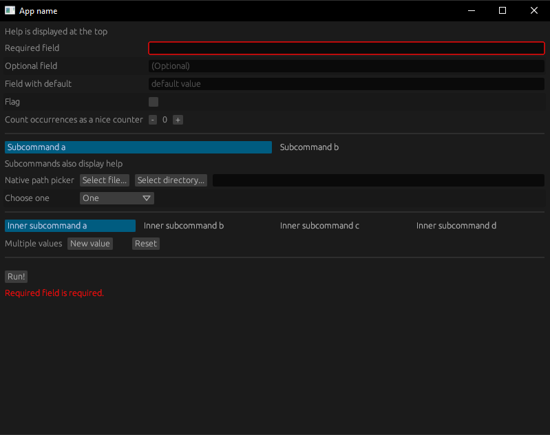
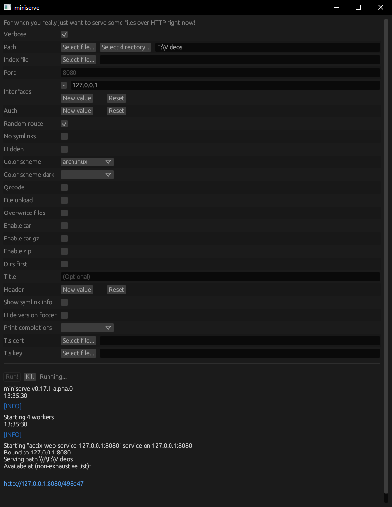

# Klask
Allows you to create a gui application automatically from clap (v3). Uses egui for graphics. [Changelog](CHANGELOG.md)

## Features
- Supports optional fields with and without default values
- Supports flags with multiple occurrences (`-vvv`)
- Has a native path picker
- Supports fields with multiple values
- Output is colored and has clickable links
- Combo boxes for arguments with only some values allowed
- Subcommands
- Optionally allow setting environment variables, stdin and working directory
- Progress bars

If you are using this library please contact me, I'm definitely interested!
Create an Issue if you find any bugs or would like a feature added!

Example gui:

Generated from [miniserve](https://github.com/svenstaro/miniserve)'s app:

## How it works

* The binary runs and there's no `CHILD_APP_ENV_VAR` environment variable ⇾ no user code runs, only the GUI is displayed.
* The "Run" button in the GUI is pressed ⇾ `CHILD_APP_ENV_VAR` is set, the binary is started again. Arguments are passed to `stdin` and `stdout` is intercepted for displaying output.
* The binary is run with `CHILD_APP_ENV_VAR` ⇾ the user-provided closure is run.
