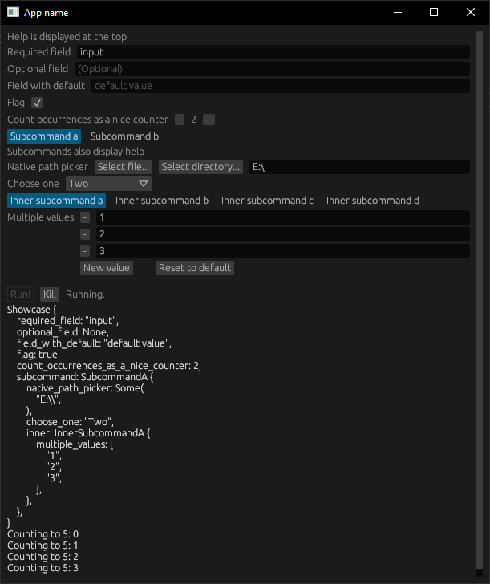
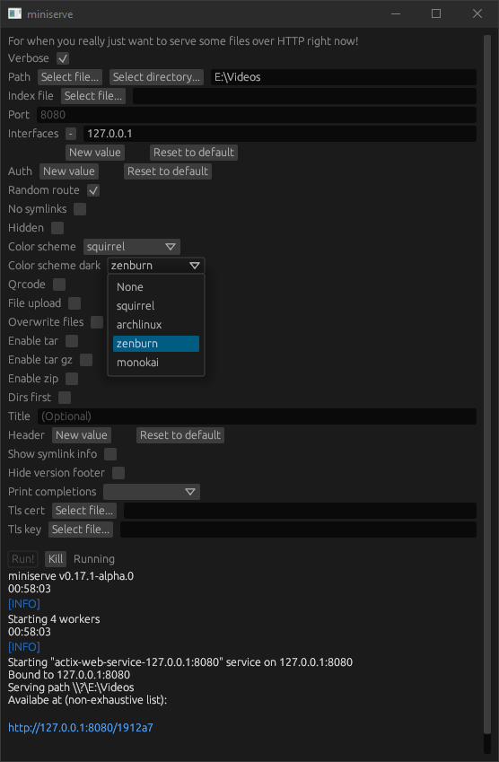

# Klask
Allows you to create a gui application automatically with clap. Uses egui for for graphics. Currently requires nightly.

## Features
- Supports optional fields with and without default values
- Supports flags with multiple occurences (`-vvv`)
- Has native path picker
- Supports fields with multiple values
- Output is colored and has clickable links

Unfurtunately there are still many edge- (and not so edge-) cases where the command generation breaks.

Example gui:

Generated from miniserve's app:
